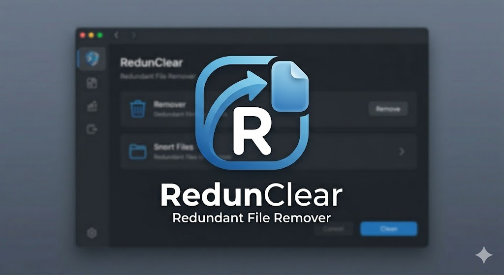

<div align="center">
  
</div>

# 🗂 Redundant File Remover v3.0

> A fast, safe, professional desktop app to **find and remove duplicate files** — with a live Storage Tree View, SHA-256 content scanning, and always-safe Recycle Bin deletion.

   

---

## ✨ Features

- ⚡ **Lightning Fast Scanning** — groups files by size *before* calculating hashes, bypassing hashing on 99% of distinct files. Multi-threaded SHA-256 ensures identical copies are caught quickly.
- 🗂 **Storage Tree View** — visualise your folder structure as a collapsible tree with folder size rollups.
- 🚀 **Auto-Scan** — immediately starts scanning as soon as you select a directory.
- 🔒 **OS Safety Guards** — system/protected paths are automatically blocked from scanning and deletion.
- ♻️ **Always uses Recycle Bin** — nothing is permanently deleted; restore anytime.
- 🎨 **Modern dark UI** — GitHub-style dark theme with branch-line tree nodes.
- 🖱️ **Right-click context menus** — open in Explorer, check/uncheck, delete individual files.
- 🔍 **Multiple match modes** — Content Hash (SHA-256), File Name, or both.

---

## 🚀 Installation (All Platforms)

### Prerequisites — Python 3.10 or newer

Check if you already have Python:
```bash
python --version
# or
python3 --version
```

If not installed, download from 👉 https://www.python.org/downloads/

> **Windows users:** During install, check ✅ **"Add Python to PATH"**

---

### 🪟 Windows Setup
1. Clone or download this repository to your computer.
2. Double-click the **`install.bat`** file.
3. The script will automatically install all required dependencies (like PyQt6) and create a **Redundant File Remover** shortcut directly on your Desktop!
4. *(To Run)*: Double-click the **Desktop shortcut** generated by the installer or execute `run.bat`.

### 🍎 macOS Setup
1. Clone or download this repository.
2. Open Terminal, navigate to the folder, and run:
   ```bash
   bash install.sh
   ```
3. The script will install dependencies and automatically create a native macOS App Bundle (`.app`) in your `/Applications` folder!
4. *(To Run)*: Open **Redundant File Remover** directly from your **Launchpad** or `/Applications` folder.

### 🐧 Linux Setup
1. Clone or download this repository.
2. Open your terminal, navigate to the folder, and run:
   ```bash
   bash install.sh
   ```
3. The script will install dependencies and generate a fully-featured `.desktop` application launcher.
4. *(To Run)*: Search for **Redundant File Remover** in your system's application menu/launcher.

---

## 📦 Bundle as a Standalone EXE (Windows)

Want a ready-to-run `.exe` that doesn't even require Python installed on the target computer?

1. Double-click **`build_exe.bat`**.
2. Wait for PyInstaller to download dependencies and seamlessly build your executable.
3. Once completed, your portable application is located at `dist\RedundantFileRemover.exe`!

*(To build similarly on macOS or Linux, ensure `pyinstaller` is installed via `pip install pyinstaller` and run `python3 -m PyInstaller --onefile --windowed --name "RedundantFileRemover" redundant_file_remover.py`.)*

---

## 🛡️ Safety Guarantees

| Protection | Details |
|---|---|
| **Recycle Bin only** | Files are never permanently deleted — always go to Trash/Recycle Bin |
| **System path guard** | `Windows`, `System32`, `Program Files`, `AppData`, `/usr`, `/etc` etc. are blocked |
| **Protected extensions** | `.exe`, `.dll`, `.sys`, `.bat`, `.ps1` and other OS files are flagged and deletion is disabled |
| **Confirmation dialog** | Every deletion requires an explicit Yes/No confirmation |
| **Protected items skipped** | Auto-select skips all protected files automatically |

---

## 📋 Usage Guide

1. **Click "Browse Folder"** in the sidebar to pick a directory.
2. **Auto-Scan Starts** — Unless you selected a blocked OS folder, the app immediately calculates duplicates using its new optimized grouping engine.
3. *(Optional)* Configure your exact match mode, minimum size, and specific extensions before running a subsequent manual scan using **"Start Scan"**.
4. **Duplicates appear** as grouped tree nodes.
5. **Check files** to mark for deletion (or use "Select Dupes" to auto-check the newest entries).
6. **Click "Move to Recycle Bin"** — files are safely removed and recoverable.
7. **Switch to Storage Tree View tab** → click "Load Tree" to explore your folder visually.

---

## 🔧 Requirements

| Package | Version | Purpose |
|---|---|---|
| `PyQt6` | ≥ 6.4 | GUI framework |
| `send2trash` | ≥ 1.8 | Safe Recycle Bin deletion |

All other imports (`os`, `hashlib`, `pathlib`, etc.) are Python standard library — no extra install needed.

---

## 📄 License

*A5A9
